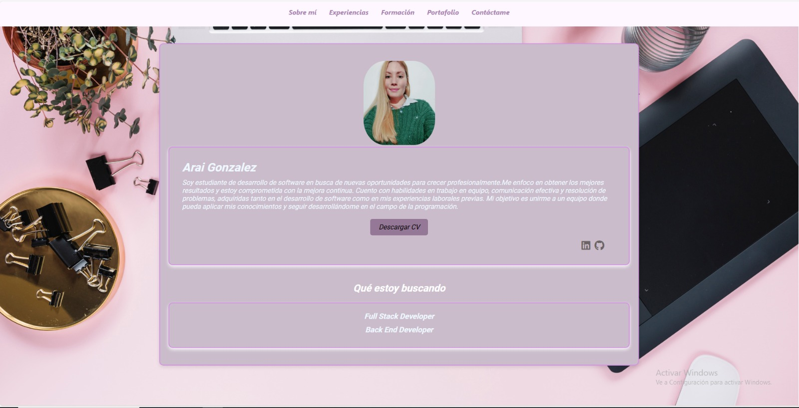

# Portafolio de Desarrolladora Front End

Este portafolio ha sido desarrollado para la materia de Front End de la carrera de Desarrollo de Software en el Instituto IFTS 29. El objetivo de este proyecto es presentar mi experiencia, formación, proyectos realizados y ofrecer un medio de contacto.

## Secciones del Portafolio

1. **Sobre mí**
   - Contiene una imagen de perfil.
   - Breve presentación personal.
   - Botón para descargar mi CV.
   - Íconos con enlaces a mis perfiles de LinkedIn y GitHub.

2. **Formación**
   - Incluye detalles sobre mi formación complementaria.
   - Formación académica actual en IFTS 29.

3. **Experiencia**
   - Breve descripción de mi experiencia actual en el campo del desarrollo.

4. **Portafolio**
   - Presenta proyectos realizados en cursos.
   - Nota: Algunos proyectos aún faltan por agregar y deployar.

5. **Contáctame**
   - Contiene un formulario de contacto con mi correo electrónico incluido.
   - Implementa lógica en JavaScript y utiliza Email.js para el envío de correos.

## Características Técnicas

- Todo el portafolio es **responsivo**, adaptándose a diferentes dispositivos y tamaños de pantalla.
- Las secciones están organizadas en cajas para una mejor visualización.
- **Manejo de tamaños en los contenedores**: Se han utilizado unidades relativas como %, flex para los contenedores principales en el width, y unidades como px o vh en el height cuando es necesario.
- **Elementos en bloque y en línea**: Se ha evitado el uso de saltos de línea ` `
- **Box model**: utilización de márgenes, bordes y padding para acomodar el contenido y espaciado.
- **Centrado de elementos**: Se ha utilizado `text-align` para centrar textos y `margin: 0 auto;` o flexbox para centrar otros elementos.
- **Manejo de fuentes**: Se ha agregado un `font-family` propio descargado de Google Fonts y se ha utilizado `font-size` con unidades relativas en la versión móvil.
- **Uso de iconos**: Se han utilizado iconos de Font Awesome, iconos de linkedin y GitHub
- **Manejo de enlaces con pseudoclases**: Los enlaces han sido estilizados utilizando `a:link`, `a:visited`, `a:hover`, `a:active`.
- **Uso de listas para el nav**: El menú de navegación se ha implementado utilizando listas.
- **Manejo de opacidad**: Se ha utilizado opacidad en algunos elementos de la seccion portafolio para oscurecer fondos y resaltar el texto.

## Cómo Acceder

Puedes acceder al portafolio desplegado en GitHub Pages a través del siguiente enlace: https://araigonzalez.github.io/Portafolio-Arai/

## Tecnologías Utilizadas

- HTML
- CSS
- JavaScript
- Email.js

Gracias por visitar mi portafolio.
